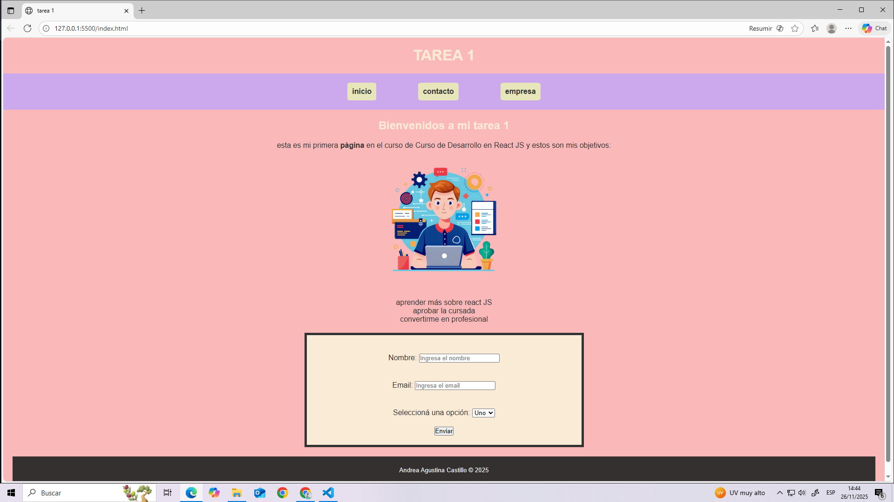
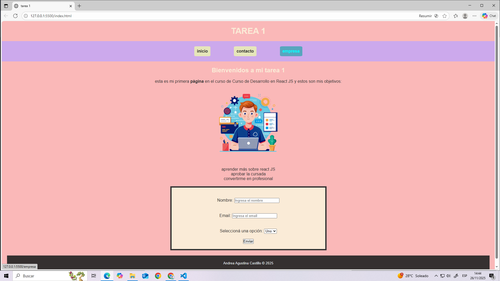

# tarea1-utn

## 📌 Este proyecto consiste en una página web creada con HTML y CSS siguiendo las consignas de la tarea.

## 🛠️ Instrucciones para clonar y ejecutar el proyecto

###  Clonar el repositorio

# Alumno: Andrea Agustina Castillo
# Curso: Curso de desarrollo en React JS.
# Unidad: 1

##Imagen: pixabay

##capturas de la pagina

